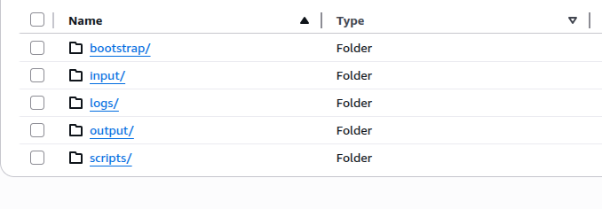

# Twitter Sentiment Analysis - Setup Guide

This guide walks you through setting up and running the Twitter sentiment analysis pipeline on AWS EMR.

## Prerequisites

- AWS Account with appropriate IAM permissions
- AWS CLI installed and configured (Optional)
- Python 3.8+ installed locally
- Basic familiarity with AWS S3 and EMR

## Step 1: Create S3 Bucket

Create a dedicated S3 bucket for your project through the AWS Console or CLI. Ensure the bucket name is globally unique.

## Step 2: Upload Project Files

Upload the necessary files to S3 with a proper folder structure:


- *Figure 1: Creating S3 bucket in AWS Console*

## Step 3: Create EMR Cluster

Navigate to EMR in AWS Console and click "Create cluster" and configure the cluster to run Spark applications.

**Important Configuration Steps:**
- Add bootstrap action to install dependencies when creating the cluster
- Choose the logs path in S3 for your EMR logs
- Choose Amazon EC2 key pair if you wish to SSH to the cluster

**Example Setup with Default Spark Application Bundle:**

| Configuration | Value |
|--------------|-------|
| Name | Your cluster name |
| EMR version | emr-7.9.0 |
| Applications | Spark, Hadoop, JupyterEnterpriseGateway |
| Instance type | m5.xlarge |
| Instance count | 3 |

## Step 4: Setup Step

1. Go to the created cluster in AWS console
2. Create a step targeting the scripts folder in S3 - `sentiment_analysis.py`
3. Provide the following arguments:

```bash
--input_path s3://<input-bucket-folder-path>/tweets.csv --output_path s3://<output-bucket-folder-path>
```

## Step 5: Download Results
- Once the step completes successfully, download the results from your S3 output bucket
- Navigate to your S3 bucket
- Go to the output folder
- Select the CSV file
- Click "Download"

## Step 6: Analyze Results
- Once the step completes successfully, download the results from your S3 output bucket
- Navigate to your S3 bucket
- Go to the output folder
- Select the CSV file
- Click "Download"

1. Open Jupyter Notebook
```bash
jupyter notebook
```
2. Navigate to the notebooks folder and open sentiment-analysis-tweets.ipynb

3. Update the file path in the notebook to point to your downloaded results:
```python
file_path = 'sentiment_results.csv'  # Change this to your actual file path
```
4. Run all cells in the notebook to generate:

- Sentiment distribution charts
- Word clouds
- Statistical analysis
- Time-series visualizations
